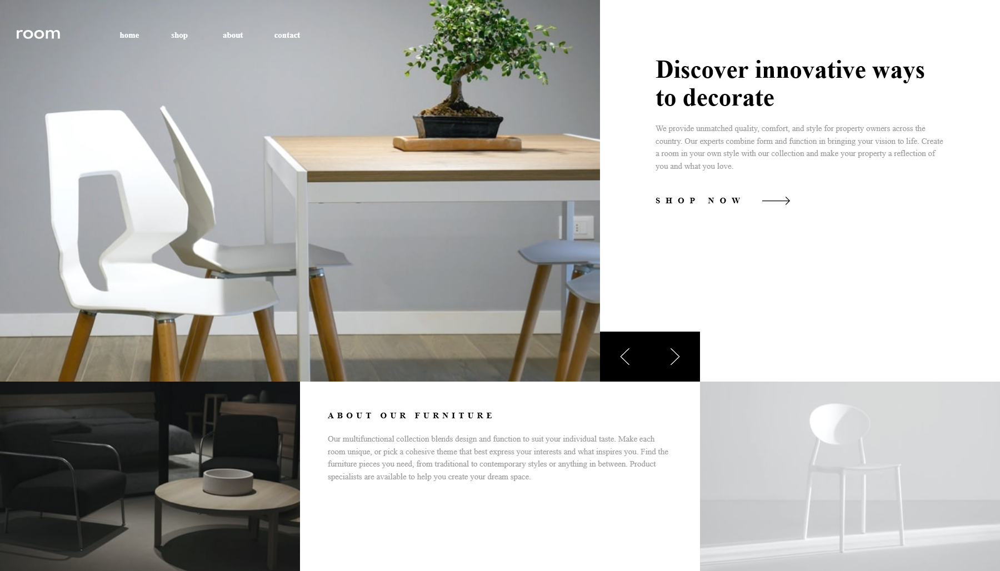

# Frontend Mentor - Room homepage solution

This is a solution to the [Room homepage challenge on Frontend Mentor](https://www.frontendmentor.io/challenges/room-homepage-BtdBY_ENq). Frontend Mentor challenges help you improve your coding skills by building realistic projects. 

## Table of contents

- [Overview](#overview)
- [The challenge](#the-challenge)
- [Screenshot](#screenshot)
- [Links](#links)
- [Built with](#built-with)
- [Useful resources](#useful-resources)
- [Author](#author)

## Overview

### The challenge

Users should be able to:

- View the optimal layout for the site depending on their device's screen size
- See hover states for all interactive elements on the page
- Navigate the slider using either their mouse/trackpad or keyboard

### Screenshot

### Links

- Solution URL: [Add solution URL here](https://github.com/dunielm02/room-homepage-challenge)
- Live Site URL: [Add live site URL here](https://dunielm02.github.io/room-homepage-challenge/)

## My process

### Built with

- Semantic HTML5 markup
- CSS custom properties
- Flexbox
- CSS Grid
- Mobile-first workflow
- [Vue](https://vuejs.org/) - JS library
- [tailwindcss](https://tailwindcss.com/) - For styles

### Useful resources

- [mitt](https://github.com/developit/mitt) - this helped me to emit events globally.

## Author

- Website - [Duniel Mesa Díaz](https://github.com/dunielm02)
- Frontend Mentor - [@dunielm02](https://www.frontendmentor.io/profile/dunielm02)
